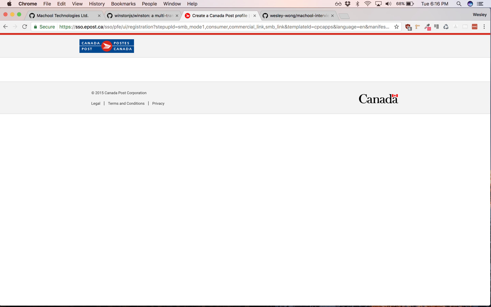
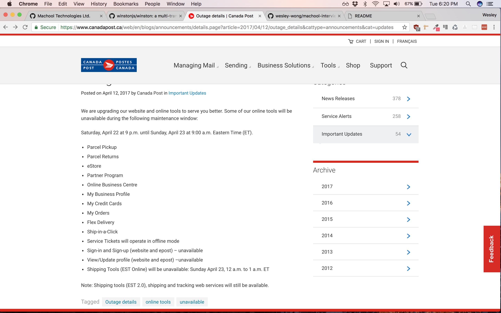

# Machool - Shipping challenge

### WORK IN PROGRESS


*as of April 18, 6:30PM, Canada Post Signup Page is not working, and the site says that online services will not be working this weekend*





## Commands
```bash
npm i
npm run dev
```

## Bonus
Fee free to take this challenge to the next level
- TypeScript
- Webpack
- Create your own logger
- Keep in mind the multi providers pattern
